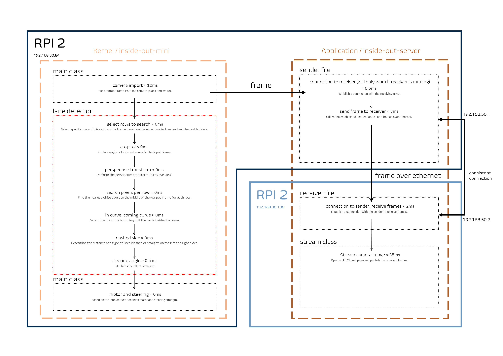

## Pi-Car-Turbo Project

 
- Adapter -> Modification of the old vehicle using the 3D printer  
 
- camera_rear:  
- hough          -> hough algorithm (#outdated)  
- machine-learn  -> machine learning algorithm (#outdated)  
- record-video   -> file to record a video (#finished)  
- samples        -> samples of the car  
 
- camera_front:  
- sliding-windows -> sliding windows (#outdated)  
- inside-out      -> efficent technique (#in development)  
 
- camera_record:  
- video recording -> file to record a video (#finished)  
 
- presentation:  
- Explanation of the Hough algorithm: "Explanation of the Hough algorithm"  
- Explanation of sliding windows: "Explanation of sliding windows"  

The project utilizes the [PiRacer-Py](https://github.com/twyleg/piracer_py) library.
